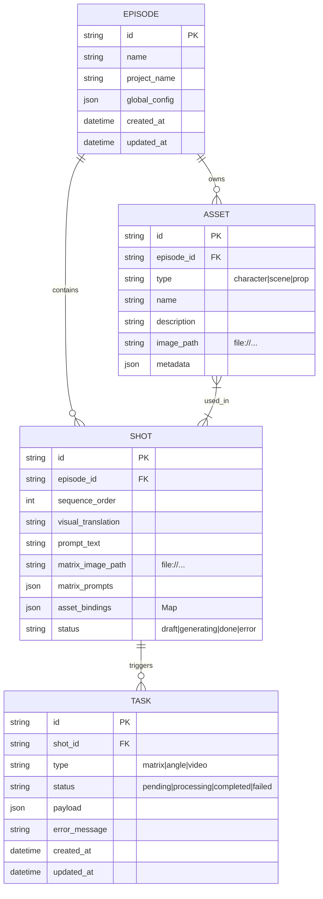

# Phase 5 Step 1: SQLite Schema Specification

## 1. Overview

This document defines the data persistence layer for Omni Director Pre-viz using SQLite.
The goal is to replace `localStorage` with a robust, relational database residing in the Electron Main process, accessed via IPC.

**Driver Selection**: `better-sqlite3` (Performance, Synchronous API for simplicity in Main).
**Location**: `app.getPath('userData')/omni-director.db`

## 2. Entity-Relationship (ER) Model



## 3. Database Schema (DDL)

All tables use `TEXT` for IDs (UUID or NanoID). Dates are stored as ISO8601 strings.

### 3.1 `episodes`
Stores the high-level container.

```sql
CREATE TABLE IF NOT EXISTS episodes (
    id TEXT PRIMARY KEY,
    name TEXT NOT NULL,
    project_name TEXT DEFAULT 'Untitled Project',
    global_config TEXT, -- JSON: { resolution, aspectRatio, ... }
    created_at TEXT NOT NULL,
    updated_at TEXT NOT NULL
);
```

### 3.2 `assets`
Stores Characters, Scenes, Props defined in the Sidebar.

```sql
CREATE TABLE IF NOT EXISTS assets (
    id TEXT PRIMARY KEY,
    episode_id TEXT NOT NULL,
    type TEXT NOT NULL CHECK(type IN ('character', 'scene', 'prop')),
    name TEXT NOT NULL,
    description TEXT,
    image_path TEXT, -- Local file path or Data URI (transitioning to path)
    metadata TEXT, -- JSON: { voiceId, referenceUrl, ... }
    created_at TEXT NOT NULL,
    updated_at TEXT NOT NULL,
    FOREIGN KEY(episode_id) REFERENCES episodes(id) ON DELETE CASCADE
);

CREATE INDEX idx_assets_episode ON assets(episode_id);
```

### 3.3 `shots`
Stores the Storyboard/Matrix items.

```sql
CREATE TABLE IF NOT EXISTS shots (
    id TEXT PRIMARY KEY,
    episode_id TEXT NOT NULL,
    sequence_order INTEGER DEFAULT 0,
    
    -- Core Content
    visual_translation TEXT,
    prompt_text TEXT,
    
    -- Generated Media (Paths relative to project output or absolute)
    matrix_image_path TEXT,
    animatic_video_path TEXT,
    asset_video_path TEXT,
    
    -- Structured Data
    matrix_prompts TEXT, -- JSON: Array of prompt strings
    split_images TEXT,   -- JSON: Array of paths [Angle_01, Angle_02...]
    video_urls TEXT,     -- JSON: Array of paths for angle videos
    
    -- Relations (Denormalized for performance, or use junction table if strict)
    -- Storing IDs as JSON arrays for now to match current frontend Logic
    character_ids TEXT, -- JSON: ["char_1", "char_2"]
    scene_ids TEXT,     -- JSON: ["scene_1"]
    prop_ids TEXT,      -- JSON: []
    
    status TEXT DEFAULT 'draft',
    created_at TEXT NOT NULL,
    updated_at TEXT NOT NULL,
    FOREIGN KEY(episode_id) REFERENCES episodes(id) ON DELETE CASCADE
);

CREATE INDEX idx_shots_episode ON shots(episode_id);
```

### 3.4 `tasks` (Future Phase 6 Foundation)
Stores async job states.

```sql
CREATE TABLE IF NOT EXISTS tasks (
    id TEXT PRIMARY KEY,
    shot_id TEXT,
    type TEXT NOT NULL,
    status TEXT NOT NULL,
    payload TEXT, -- JSON parameters used to run the task
    result TEXT,  -- JSON output
    error_message TEXT,
    created_at TEXT NOT NULL,
    updated_at TEXT NOT NULL,
    FOREIGN KEY(shot_id) REFERENCES shots(id) ON DELETE CASCADE
);
```

## 4. TypeScript Interfaces

These should act as the **DTOs** (Data Transfer Objects) between SQLite and Frontend.

```typescript
// src/shared/types/db.ts

export interface DBEpisode {
  id: string;
  name: string;
  project_name: string;
  global_config: string; // JSON stringified GlobalConfig
  created_at: string;
  updated_at: string;
}

export interface DBAsset {
  id: string;
  episode_id: string;
  type: 'character' | 'scene' | 'prop';
  name: string;
  description?: string;
  image_path?: string;
  metadata?: string; // JSON stringified
  created_at: string;
  updated_at: string;
}

export interface DBShot {
  id: string;
  episode_id: string;
  sequence_order: number;
  visual_translation?: string;
  prompt_text?: string;
  matrix_image_path?: string;
  animatic_video_path?: string;
  asset_video_path?: string;
  matrix_prompts?: string; // JSON stringified string[]
  split_images?: string;   // JSON stringified string[]
  video_urls?: string;     // JSON stringified string[]
  character_ids?: string;  // JSON stringified string[]
  scene_ids?: string;      // JSON stringified string[]
  prop_ids?: string;       // JSON stringified string[]
  status: string;
  created_at: string;
  updated_at: string;
}
```

## 5. Migration Strategy

### 5.1 Versioning
We will use a `_migrations` table to track schema version.

```sql
CREATE TABLE IF NOT EXISTS _migrations (
    id INTEGER PRIMARY KEY AUTOINCREMENT,
    version TEXT NOT NULL,
    applied_at TEXT NOT NULL
);
```

### 5.2 Initial Import (V1)
Since we are moving from `localStorage`, the initial DB will be empty.
We provide an IPC endpoint `app:importFromLocalStorage` which:
1.  Receives the full JSON state from Renderer.
2.  Creates a new `Episode` (using current timestamp or user provided name).
3.  Iterates and inserts `Assets`.
4.  Iterates and inserts `Shots`.
5.  **Crucial**: Handles Base64 images.
    *   If the imported data contains Base64 Data URIs, the migration service should asynchronously write them to disk (`output/imported_assets/`) and update the DB with `file://` paths.
    *   This prevents bloating the DB with massive text strings.

## 6. Next Steps (Implementation)

1.  **Install**: `npm install better-sqlite3` & `npm install -D @types/better-sqlite3`.
    *   *Note*: Ensure `electron-builder` config handles native dependencies correctly.
2.  **Service**: Create `src/main/db/index.ts` (Singleton connection).
3.  **Repositories**: Create `src/main/db/episodeRepo.ts`, `shotRepo.ts`.
4.  **IPC**: Expose `app:db:loadEpisode`, `app:db:saveShot`, etc.
# Phase 5 Step 1: SQLite Schema Specification

**状态**: Draft (G队已生成，待确认)  
**作者**: G 队 (Aux)  
**日期**: 2025-12-22  
**范围**: Phase 5 / Step 1（Schema 规范 + DDL + DTO + 迁移策略）

---

## 0. 决策与约束

- **Driver**: `better-sqlite3`（Main 进程同步 API，性能佳；需注意 Electron rebuild）。
- **层级**: 先做 Episode 平铺（Project/Season 预留字段或 tags）。
- **迁移**: **手动触发**（Sidebar 提供 Import 按钮，避免启动自动迁移）。
- **媒体落盘**: Base64 图片必须转存为文件，DB 仅保存相对路径，避免膨胀。

---

## 1. ER 模型（关系概要）

- **Episode 1 - N Shot**
- **Episode 1 - N Asset**
- **Shot 1 - N Task**

说明：
- 资产与镜头的关系暂以 `shot.character_ids / scene_ids / prop_ids` 的 JSON 列存储。
- 后续如需严谨关联可引入 `shot_asset_link` 表。

---

## 2. 表结构 (DDL)

> 所有 JSON 字段以 TEXT 保存，序列化格式为 `JSON.stringify(...)`。

```sql
PRAGMA journal_mode=WAL;
PRAGMA foreign_keys=ON;

-- 用于版本控制
CREATE TABLE IF NOT EXISTS meta (
  key TEXT PRIMARY KEY,
  value TEXT NOT NULL
);

-- Episode
CREATE TABLE IF NOT EXISTS episodes (
  id TEXT PRIMARY KEY,
  title TEXT,
  script TEXT,
  context TEXT,
  config_json TEXT NOT NULL,
  tags_json TEXT,
  created_at INTEGER NOT NULL,
  updated_at INTEGER NOT NULL
);

-- Shot
CREATE TABLE IF NOT EXISTS shots (
  id TEXT PRIMARY KEY,
  episode_id TEXT NOT NULL,
  order_index INTEGER NOT NULL DEFAULT 0,
  original_text TEXT,
  visual_translation TEXT,
  context_tag TEXT,
  shot_kind TEXT,
  matrix_prompts_json TEXT,
  generated_image_path TEXT,
  split_images_json TEXT,
  video_urls_json TEXT,
  animatic_video_path TEXT,
  asset_video_path TEXT,
  status TEXT,
  video_status_json TEXT,
  progress REAL,
  history_json TEXT,
  optimization_json TEXT,
  character_ids_json TEXT,
  scene_ids_json TEXT,
  prop_ids_json TEXT,
  linked_shot_ids_json TEXT,
  last_accessed_at INTEGER,
  created_at INTEGER NOT NULL,
  updated_at INTEGER NOT NULL,
  FOREIGN KEY (episode_id) REFERENCES episodes(id) ON DELETE CASCADE
);

-- Asset
CREATE TABLE IF NOT EXISTS assets (
  id TEXT PRIMARY KEY,
  episode_id TEXT NOT NULL,
  type TEXT NOT NULL, -- character | scene | prop
  name TEXT NOT NULL,
  description TEXT,
  ref_image_path TEXT,
  tags_json TEXT,
  created_at INTEGER NOT NULL,
  updated_at INTEGER NOT NULL,
  FOREIGN KEY (episode_id) REFERENCES episodes(id) ON DELETE CASCADE
);

-- Task（预留队列字段）
CREATE TABLE IF NOT EXISTS tasks (
  id TEXT PRIMARY KEY,
  episode_id TEXT NOT NULL,
  shot_id TEXT,
  type TEXT NOT NULL, -- LLM | IMAGE | VIDEO | EXPORT
  status TEXT NOT NULL, -- queued | running | completed | failed | cancelled
  progress REAL,
  payload_json TEXT,
  result_json TEXT,
  error TEXT,
  created_at INTEGER NOT NULL,
  updated_at INTEGER NOT NULL,
  FOREIGN KEY (episode_id) REFERENCES episodes(id) ON DELETE CASCADE,
  FOREIGN KEY (shot_id) REFERENCES shots(id) ON DELETE SET NULL
);

CREATE INDEX IF NOT EXISTS idx_shots_episode ON shots(episode_id);
CREATE INDEX IF NOT EXISTS idx_assets_episode ON assets(episode_id);
CREATE INDEX IF NOT EXISTS idx_tasks_episode ON tasks(episode_id);
CREATE INDEX IF NOT EXISTS idx_tasks_shot ON tasks(shot_id);
```

---

## 3. TypeScript DTO (对齐 IPC)

```ts
export interface EpisodeRecord {
  id: string;
  title?: string;
  script?: string;
  context?: string;
  config: {
    artStyle: string;
    aspectRatio: '16:9' | '9:16';
    resolution: '1K' | '2K' | '4K';
    apiProvider: 'aihubmix';
  };
  tags?: string[];
  createdAt: number;
  updatedAt: number;
}

export interface ShotRecord {
  id: string;
  episodeId: string;
  orderIndex: number;
  originalText?: string;
  visualTranslation?: string;
  contextTag?: string;
  shotKind?: 'CHAR' | 'ENV' | 'POV' | 'INSERT' | 'MIXED';
  matrixPrompts?: string[];
  generatedImagePath?: string;
  splitImages?: string[];
  videoUrls?: (string | null)[];
  animaticVideoPath?: string | null;
  assetVideoPath?: string | null;
  status?: 'pending' | 'processing' | 'completed' | 'failed';
  videoStatus?: ('idle' | 'queued' | 'processing' | 'downloading' | 'completed' | 'failed')[];
  progress?: number;
  history?: any[];
  optimization?: any;
  characterIds?: string[];
  sceneIds?: string[];
  propIds?: string[];
  linkedShotIds?: string[];
  lastAccessedAt?: number;
  createdAt: number;
  updatedAt: number;
}

export interface AssetRecord {
  id: string;
  episodeId: string;
  type: 'character' | 'scene' | 'prop';
  name: string;
  description?: string;
  refImagePath?: string;
  tags?: string[];
  createdAt: number;
  updatedAt: number;
}

export interface TaskRecord {
  id: string;
  episodeId: string;
  shotId?: string | null;
  type: 'LLM' | 'IMAGE' | 'VIDEO' | 'EXPORT';
  status: 'queued' | 'running' | 'completed' | 'failed' | 'cancelled';
  progress?: number;
  payload?: any;
  result?: any;
  error?: string;
  createdAt: number;
  updatedAt: number;
}
```

---

## 4. 迁移策略 (V1.0.0)

1) **手动触发**：在 Sidebar 加 “Import from LocalStorage”。  
2) **读取**：从 LocalStorage 取 `config/script/breakdown`。  
3) **落盘**：  
   - Base64 图像/视频先写入文件（media_root），DB 仅存相对路径。  
   - Episode/Shot/Asset 按当前数据结构一次性写入。  
4) **回滚**：导入失败则不更新 `meta.schema_version`。  

> 建议：导入前提示用户备份；导入完成后可提供“清理旧数据”按钮。

---

## 5. 媒体路径约定（建议）

- `media_root = OMNI_OUTPUT_DIR || app.getPath('userData')/output`
- 资产参考图：`media_root/episodes/{episodeId}/assets/{assetId}.png`
- 母图与切片：`media_root/episodes/{episodeId}/shots/{shotId}/`
- 视频：`media_root/episodes/{episodeId}/shots/{shotId}/videos/`

---

## 6. 注意事项

- Renderer 不得直接访问 DB/FS；必须通过 IPC。
- JSON 字段统一做版本兼容（缺省为 `[]` 或 `{}`）。
- `better-sqlite3` 需处理 Electron rebuild；安装策略在 Step 2 说明。
